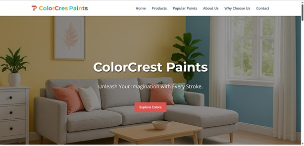
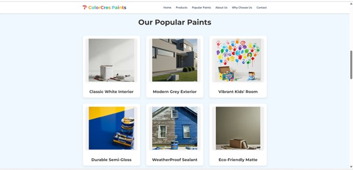
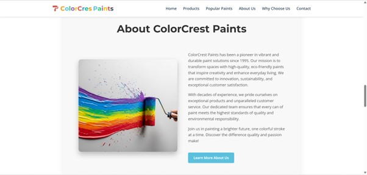
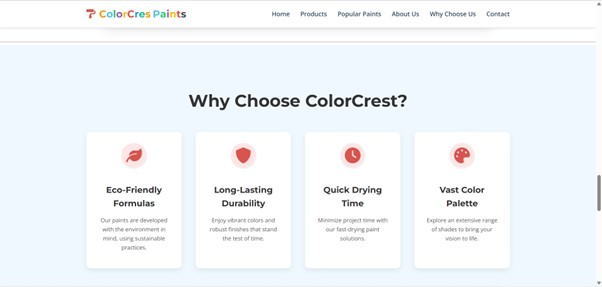
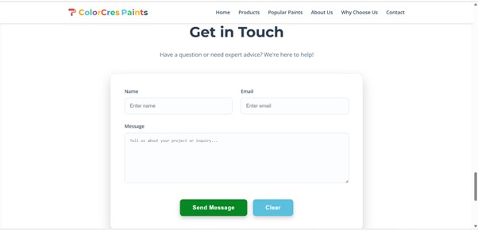
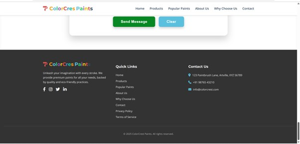

# colorcrest-landing-page
Responsive landing page for ColorCrest Paints

# ColorCrest Paints 

A responsive and visually appealing landing page for the fictional brand **ColorCrest Paints**.  
It showcases paint product categories, brand values, and a contact section.

---

##  Live Demo

🔗 Click here to view live https://colorcrest-landing-page.netlify.app
_Replace with your actual deployment link from Netlify or Vercel._

---

##  Sections Included

-  Hero Section with banner and CTA button
-  Product Categories (Interior, Exterior, Wood, Metal Paints)
-  Why Choose Us – Highlights brand benefits
-  Contact / Inquiry Section with form or CTA
-  Footer with brand name and social icons

---

##  Tech Stack Used

- HTML5
- CSS3
- Optional: Bootstrap 5
- Optional: JavaScript (for smooth scroll or form)

---
##  Screenshots

### 🔹 Hero Section


### 🔹 Product Categories


### 🔹 About Us Section


### 🔹 Why Choose Us


### 🔹 Contact Section


### 🔹 Footer


##  How to Run Locally

1. Clone the repo:
   ```bash
   git clone https://github.com/your-username/colorcrest-landing-page.git

# Author

**Sadhana Gonge**  
GitHub: [@sadhanagonge](https://github.com/sadhana79)

